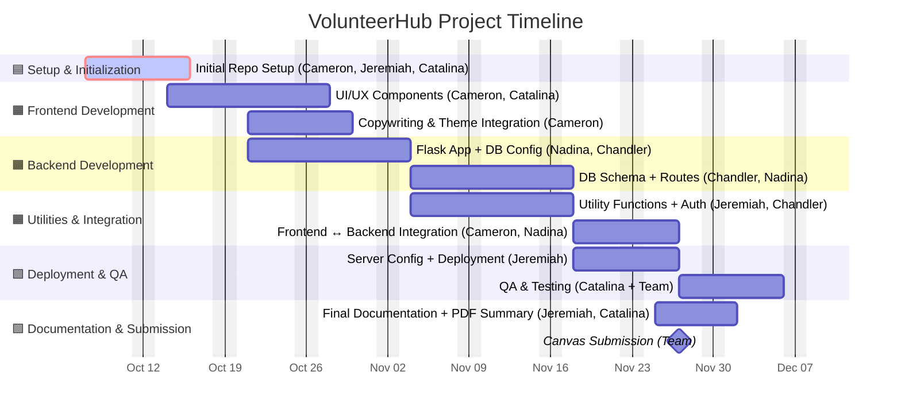

# VolunteerHub – Color-Coded Gantt Timeline (with Roles & Phases)

---

### ✅ Legend

| Color | Category          | Description                                      | Lead Roles                |
| :---- | :---------------- | :----------------------------------------------- | :------------------------ |
| 🟦     | Git / Setup       | Repository creation, initial project scaffolding | Cameron, Jeremiah         |
| 🟧     | Development       | Core frontend, backend, and API logic            | Cameron, Nadina, Chandler |
| 🟩     | Live / Deployment | QA, hosting, and final submission                | Jeremiah, Catalina        |

---
