# VolunteerHub – Color-Coded Gantt Timeline (with Roles & Phases)

```mermaid
gantt
    title VolunteerHub Project Timeline
    dateFormat  YYYY-MM-DD
    excludes    weekends
    axisFormat  %b %d
    todayMarker off

    %% ===== COLOR LEGEND =====
    %% Blue: Git/Setup, Orange: Development, Green: Live/Deployment

    section 🟦 Setup & Initialization
    Initial Repo Setup (Cameron, Jeremiah, Catalina)       :crit, active, a1, 2025-10-07, 7d

    section 🟧 Frontend Development
    UI/UX Components (Cameron, Catalina)                   :a2, 2025-10-14, 10d
    Copywriting & Theme Integration (Cameron)              :a3, 2025-10-21, 7d

    section 🟧 Backend Development
    Flask App + DB Config (Nadina, Chandler)               :a4, 2025-10-21, 10d
    DB Schema + Routes (Chandler, Nadina)                  :a5, after a4, 10d

    section 🟧 Utilities & Integration
    Utility Functions + Auth (Jeremiah, Chandler)          :a6, 2025-11-04, 10d
    Frontend ↔ Backend Integration (Cameron, Nadina)       :a7, after a6, 7d

    section 🟩 Deployment & QA
    Server Config + Deployment (Jeremiah)                  :a8, 2025-11-18, 7d
    QA & Testing (Catalina + Team)                         :a9, after a8, 7d

    section 🟩 Documentation & Submission
    Final Documentation + PDF Summary (Jeremiah, Catalina) :a10, 2025-11-25, 5d
    Canvas Submission (Team)                               :milestone, a11, 2025-11-27, 0d
```

---

### ✅ Legend

| Color | Category          | Description                                      | Lead Roles                |
| :---- | :---------------- | :----------------------------------------------- | :------------------------ |
| 🟦     | Git / Setup       | Repository creation, initial project scaffolding | Cameron, Jeremiah         |
| 🟧     | Development       | Core frontend, backend, and API logic            | Cameron, Nadina, Chandler |
| 🟩     | Live / Deployment | QA, hosting, and final submission                | Jeremiah, Catalina        |

---
